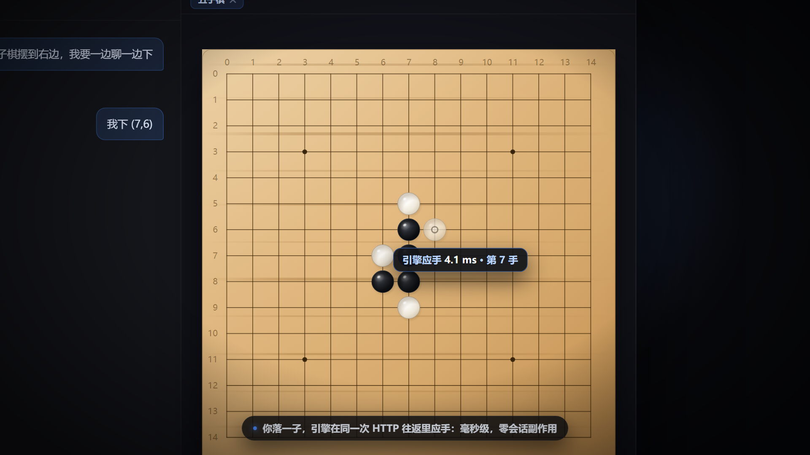

# dsh-gomoku

给 [DSH（DeepSeek Harness）](https://github.com/deepseek-ai) 用的五子棋插件：**棋盘常驻右侧边栏，
你一边聊天一边下棋**，对手可以是 Host 本地的棋力内核（毫秒级、不占用对话），也可以是模型本身。

- **规则**：freestyle（无禁手），15×15，黑先，连成五子及以上即胜（长连也算胜）。
- **默认对手**：本地棋力内核。人落一子，引擎的应对在**同一次 HTTP 往返**里就返回了——
  毫秒级，而且一个字节都不进对话。
- **可切换**：`引擎 / 模型 / 手动`。切到模型时由模型亲自落子（慢、会在对话里留消息，但能看到它"想"棋）。

## 宣传片

[](promo/out/dsh-gomoku-promo.mp4)

25.4 秒 / 1920×1080 / 30fps。成片在 [`promo/out/`](./promo/out)，一帧一帧渲染出来的
（不是录屏），所以每一屏都能单独当截图用，也能随时改文案重跑。怎么重建见
[`promo/README.md`](./promo/README.md)。

片子里的盘面是**插件真实的绘制参数**（同一套木纹渐变、棋子六层叠加、星位、坐标），
对局是**真实的一局 37 手**，延迟徽章上的数字是**实测**的引擎耗时中位数。

## 两个包，为什么要拆

| 包 | 角色 |
|---|---|
| [`dsh-gomoku-host`](./dsh-gomoku-host) | 权威棋局状态、棋力内核、四个工具、`/gomoku` 路由 |
| [`dsh-gomoku-client`](./dsh-gomoku-client) | 右侧边栏里的棋盘（React 组件，免构建 bundle） |

拆开不是风格选择，是**实测约束**：对于以 `link:` 方式安装的插件，只要 `package.json` 里出现
`dsh.client` 字段，**宿主半侧就不会激活**（同一份宿主代码，仅增删该字段，`/plugins/.../state`
在带字段时一律 404、去掉即 200；与 `inject` 内容无关）。所以宿主逻辑必须待在另一个包里。
详见 [`dsh-gomoku-host/README.md`](./dsh-gomoku-host/README.md)。

## 安装

两个包都要装。用 DSH 的 `plugin_manager` 工具（`install_bundle`），或者手工把它们 `link:`
进 profile 的 `dependencies` 并加进 `dsh.profile.bundles`：

```powershell
install_bundle  <repo>/dsh-gomoku-host
install_bundle  <repo>/dsh-gomoku-client
```

装完之后：**改宿主代码要重启应用**（Node 的 ESM 缓存按路径缓存，disable/enable 不会重新导入——
已实测）；**改客户端 bundle 只需强刷页面**（`Ctrl+Shift+R`）。宿主半侧之所以必须先重启，
是因为它只有进程重启才会重新加载。

## 架构

```
点击棋盘 ──POST /gomoku/move──▶ Host：落子
                                 │
                        agentMode == engine ？──是──▶ 棋力内核立刻应对
                                 │                    （同一往返返回，毫秒级）
                                 否
                                 ▼
                       轮到对手且是 model 模式
                                 │
        客户端 ──remote.session.prompt──▶ 唤醒会话 ──▶ 模型 gomoku_show + gomoku_move
                                 │
                                 ▼
                    客户端轮询到新 rev ──▶ 棋盘更新
```

- **权威状态在 Host**。浏览器只是一个视图与点击入口，所有合法性判断都在 Host 侧。
- **两条通道分离**：人类点击走 HTTP 路由（**只允许落人类执子的一方**，否则 403），模型走工具。
- **棋力内核**（`dsh-gomoku-host/src/ai.js`）用经典的"五窗口计分"：对每个候选点枚举经过它的
  4 个方向 × 6 个长度为 5 的窗口，按窗口中己方子数加权；先判"能不能立刻赢"，再判"对手是不是
  立刻要赢（必须堵）"，否则按总分取最优。
- **零 import 的产物**：`lib/index.js` 由 `tools/build.mjs` 把 `engine.js` + `ai.js` + `host.js`
  剥掉相对导入后内联成一个文件。这不是洁癖——插件以符号链接装进 profile，相对导入经 symlink
  会落到 profile 包表之外而被解析拦截层拒绝，表现为"装的时候能用、一重启就挡住整个 Web 启动"。

## 插件列表里的图标与文案

设置里那张插件列表，每行左边那格图标**不是一张静态图片，也没有对应路由**。DSH 的
`app-boot` 在读插件元数据时，把 `package.json` 顶层的 `icon` **读成字节、内联成 data URL**
（`data:image/svg+xml;base64,…`），客户端拿它直接 ``：

```js
// dsh-app-boot: iconOf()
const file = realpathSync(resolve(dirname(manifestPath), icon));
return `data:${mediaType};base64,${readFileSync(file).toString('base64')}`;
```

所以约束是硬的，而且**全都不会在构建期报错**——写错了只会安静地退回那个通用占位图：

| 约束 | 值 |
|---|---|
| 位置 | `package.json` **顶层**的 `icon`（不是 `dsh` 段里） |
| 路径 | 必须是**相对路径**；绝对路径、`data:`、任何带 scheme 的都会被拒 |
| 扩展名 | `.svg` / `.png` / `.jpg` / `.jpeg` / `.webp` |
| 范围 | realpath 之后仍在清单所在目录内（`link:` 安装要能穿过符号链接） |
| 大小 | **≤ 256 KiB**（原始字节） |

还有一个更隐蔽的坑：**元数据是"从包的 exports 里解析 `<包>/package.json`"读出来的**。
所以只要没导出 `./package.json`，**标题、描述、图标会一起消失**（`readPluginMeta` 直接
返回 undefined），列表里只剩包名加一个占位图——看起来像"这个插件没做图标"，其实是清单
压根没被读到。

要在列表里显示**中文标题与描述**，就走本地化：`locale/<语言>.json`，形状是

```json
{ "meta": { "title": "五子棋 · 棋盘", "description": "常驻右侧边栏的可点击棋盘——一边聊一边下棋。" } }
```

并且**必须导出 `./locale/*.json`**（英文 `en.json` 是锚点，其余语言和它同目录）。

这套规则由 `tools/check-manifest.mjs` 复刻并逐条校验（常量与判定逻辑都是从 `app-boot` 的
`iconOf` / `readPluginMeta` / `dictionariesOf` 抄下来的，不是凭印象写的）：

```powershell
node tools/check-manifest.mjs    # 33 项：图标规则 + exports 可达性 + 本地化形状
```

## 自检

三个包各自带一套可以在**不启动 DSH** 的情况下跑的测试：

```powershell
cd dsh-gomoku-host   ; node test/engine.test.mjs   # 规则内核
cd dsh-gomoku-host   ; node test/ai.test.mjs       # 棋力内核（含引擎自对弈）
cd dsh-gomoku-host   ; node test/activate.mjs      # 宿主：桩 ctx 走一遍注册/工具/路由/卸载
cd dsh-gomoku-client ; node test/client-check.mjs  # 客户端：桩 __ModuleLoader__ + 迷你 React
node tools/check-manifest.mjs                      # 插件列表的图标/文案元数据
```

客户端那一套尤其值得留着：浏览器半侧的失败**在源头就被丢弃**（DSH 的 web boot 内核审计循环
只打印 fiber 状态名，不带异常），所以"重启后弹一句 `<包名>: failed` 而没有任何原因"是常态。
这套自检能在安装之前就把契约错误、渲染异常、唤醒时序问题抓出来。

> 客户端 bundle 里内置了一个**构建徽章**（棋盘标题旁的 `v0.x.y`）和控制台面包屑
> （`[gomoku v0.x.y] …`）。改 `lib/client.js` 时**必须同时改 `BUILD` 常量**——否则
> "浏览器里跑的到底是哪一版"又会变成猜谜。

## 许可

MIT
